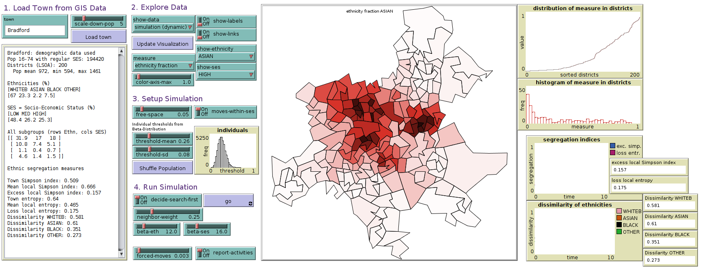
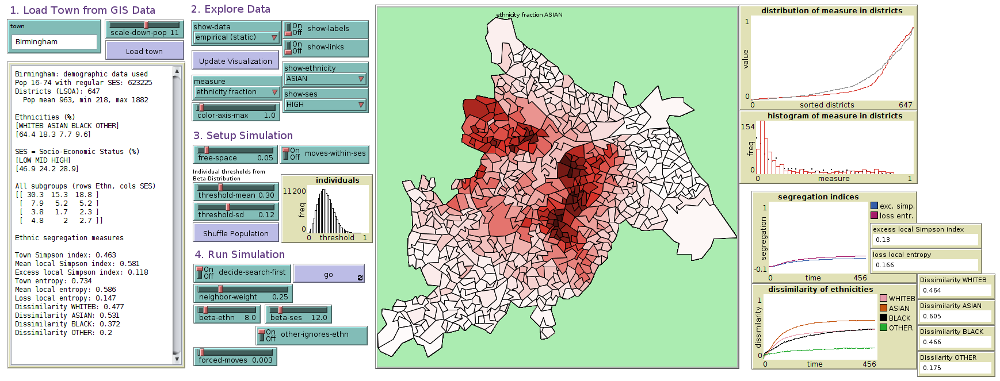
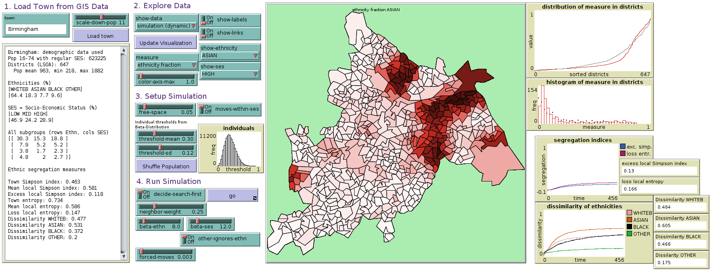
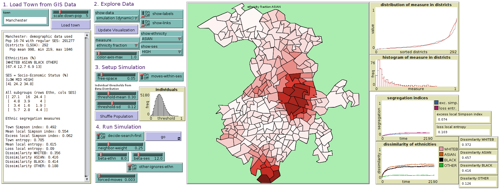
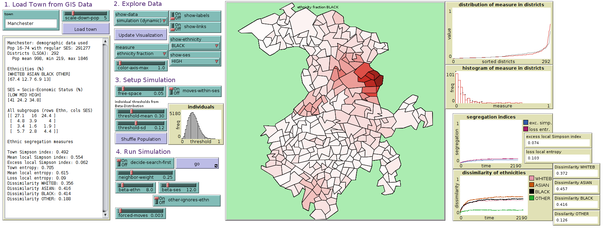
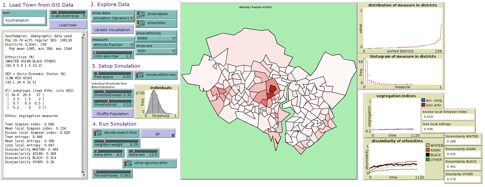
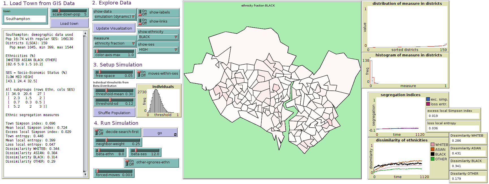

```{r setup, include=FALSE}
knitr::opts_chunk$set(echo = FALSE)
library(tidyverse)
library(knitr)
```

# Extended Abstract

Research on patterns of neighborhood ethnic segregation in the UK and, more generally, in the European context, has been very much dominated by the exploration of segregation indices (Catney 2017; Simpson 2004). While these studies are of great importance for describing the changes in the spatial distribution of ethnic minorities over time—and new methodologies have improved their calculation (Johnston et al. 2016)—they are limited first, in their ability to disentangle the mechanisms behind those changes, and second, in their capacity to predict how neighborhood ethnic segregation might evolve over time. Using aggregated census and register data from selected English cities, this study presents and discusses two alternative (and complementary) methodological approaches that address this concern. These approaches consider, in different ways, three explanatory mechanisms that have been highlighted by the literature: ethnic groups’ socioeconomic resources and how they interact with housing prices and residential structures; discrimination in the housing market; and individuals’ preferences to live close to members of the same group (Logan and Alba 1993). Specifically, we ask: first, what factors are associated to an increase in neighborhood ethnic segregation (or decrease thereof) in the UK? Second, how might segregation evolve should these mechanisms persist over time; or conversely, how could segregation reduce?

The first methodological approach considers hierarchical Bayesian spatial models of segregation (Anselin 1995) to predict observed segregation patterns.  Specifically, we investigate the behavior of local indices of segregation (2001-2011)—that is, indices that are able to classify each spatial unit in a city—with aggregated information obtained for the same spatial units in 2001. This methodology allows identifying macro-level factors associated to the observed segregation patterns; in addition, an advantage is that it allows taking into consideration the spatial autocorrelation of data, that is, the fact that contiguous spatial units are more similar to each other in their levels of spatial segregation. Preliminary analyses predicting the local spatial entropy index (a local measure of ethnic diversity)  in the city of Bradford, show that an increase in housing prices tended to de-segregate areas, making them more homogenous in terms of the ethnic-racial composition of the population, whereas certain characteristics of the population (in terms of age structures, proportion of highly educated and proportion singles) tended to increase segregation at the local level. 

The second methodological approach is based on agent-based models and, more specifically, on an improved version of Schelling’s model of segregation. Schelling (1971) showed that individuals’ preferences for in-group members—as well as their “thresholds of tolerance”—play a key role in spatial segregation. We add another key predictor of neighborhood choice: individuals’ socioeconomic characteristics (Crowder, South, and Chavez 2006).  Specifically, we first discuss the combined role of individuals’ preferences for co-ethnics and their socioeconomic status, and what the implications of this might be for Shelling’s theoretical model; next, we implement this improved model in selected cities in England, under the assumption that the role of socioeconomic  assets on neighborhood choice varies across ethnic groups (Zuccotti 2019; Coulter and Clark 2018). Preliminary results show that…

The paper concludes with an overview of the key mechanisms associated to neighborhood ethnic segregation in the UK, as well as with a discussion of the benefits and limitations of both methodologies for the study of neighborhood segregation.

# Data

```{r LoadUKData}
# source("R/write_SHP_UK_for_Netlogo.R")
load("R/data")
lsoa_ethn_ses <- long_districts %>% group_by(lsoa11cd) %>% mutate(fraction = count/sum(count))
lsoa_ethn <- lsoa_ethn_ses %>% 
  group_by(lsoa11cd, town, all, all1674valid, Ethnicity) %>% 
  summarize(fraction = sum(count) / max(all1674valid), count = sum(count))
lsoa_ses <- lsoa_ethn_ses %>% 
  group_by(lsoa11cd, town, all, all1674valid, SES) %>%  
  summarize(fraction = sum(count) / max(all1674valid), count = sum(count))
lsoa <- lsoa_ethn_ses %>% mutate(SESnum = if_else(SES=="low", 0, if_else(SES=="mid",1,2))) %>% 
  group_by(lsoa11cd, town, all, all1674valid) %>% 
  summarize(average_ses = sum(count * SESnum)/sum(count)) %>% 
  group_by(town) %>% 
  mutate(fraction_lsoa = all1674valid/sum(all1674valid)) %>% group_by()
towns_ethn_ses <- lsoa_ethn_ses %>% group_by(town, Ethnicity, SES) %>% 
  summarize(count = sum(count)) %>% group_by(town) %>% mutate(fraction = count / sum(count)) %>% group_by()
towns_ethn <- towns_ethn_ses %>%  group_by(town, Ethnicity) %>% 
  summarize(count = sum(count)) %>% group_by(town) %>% mutate(fraction = count / sum(count)) %>% group_by()
towns_ses <- towns_ethn_ses %>%  group_by(town, SES) %>% 
  summarize(count = sum(count)) %>% group_by(town) %>% mutate(fraction = count / sum(count)) %>% group_by()
towns <- towns_ethn_ses %>% mutate(SESnum = if_else(SES=="low", 0, if_else(SES=="mid",1,2))) %>% 
  group_by(town) %>% 
  summarize(average_ses = sum(count * SESnum)/sum(count), count = sum(count))
# Dissimilarity, Location Quotient
lsoa_ethn <- lsoa_ethn %>% left_join(select(towns_ethn, town, Ethnicity, fraction_ethnicity_town = fraction),
                        by = c("town", "Ethnicity")) %>% 
  group_by(lsoa11cd) %>% mutate(Dissimilarity = abs(fraction - fraction_ethnicity_town) / 
                                  (2*fraction_ethnicity_town*(1-fraction_ethnicity_town)),
                                Location_Quotient = fraction/fraction_ethnicity_town) 
towns_ethn <- lsoa_ethn %>% left_join(select(lsoa,town,lsoa11cd,fraction_lsoa), c("lsoa11cd", "town")) %>%
  group_by(town,Ethnicity) %>% 
  summarize(Dissimilarity_Index = sum(fraction_lsoa * Dissimilarity)) %>% 
  right_join(towns_ethn, c("town", "Ethnicity")) %>% group_by()
towns <- towns_ethn %>% group_by(town) %>% 
  summarize(Simpson_town = sum(fraction^2), 
            Entropy_town = -1/log(4)*sum(fraction*log(fraction))) %>% 
  right_join(towns, by = "town")
towns <- lsoa_ethn %>% left_join(rename(towns, count_town=count), by = "town") %>% 
  left_join(select(lsoa,town,lsoa11cd,fraction_lsoa), c("lsoa11cd", "town")) %>% 
  group_by(lsoa11cd, town, fraction_lsoa, Simpson_town, Entropy_town) %>%
  summarize(Simpson = sum(fraction^2), 
            Entropy = -1/log(4)*sum(fraction*
                                      if_else(fraction == 0, 0, log(fraction)))) %>% 
  mutate(Excess_Simpson = Simpson - Simpson_town, Loss_Entropy = Entropy_town - Entropy) %>% 
  group_by(town) %>% summarize(Avg_Simpson = sum(fraction_lsoa*Simpson), 
                               Avg_Excess_Simpson = sum(fraction_lsoa*Excess_Simpson), 
                               Avg_Entropy = sum(fraction_lsoa*Entropy),
                               Avg_Loss_Entropy = sum(fraction_lsoa*Loss_Entropy)) %>% 
  right_join(towns, by = "town")
```

We use census data from ..SOURCE.. from the years 2011 and 2001. 
We use LSOAs (Lower Layer Super Output Areas) of towns in England. 
These are ... towns (with population between ... and ...).
Each town has between ... and ... LSOAs. 
Each LSOA has between 1,000 and 1,500 inhabitants (that is the census goal, check real data). 
For each LSOA we extracted the contingency tables for the population with respect to four groups of ethnicities and three groups of socio-economic status. 
Reasons why we focus on towns as the upper level unit of observation. 

The ethnicty groups are composed of the following groups:

  * WHITEB (White British): ...
  * ASIAN: ... 
  * BLACK: ...
  * OTHER: ... 

Give some reasons why we use this classification. Why are Chinese in Asians although they would not consider themselves as similar, same with Indians and Pakistani? What about the black? What about other? What about Irish?
The reasons lie in a mix of 

  * data availability
  * defining not too small groups which are likely to consider themselves as from similar ethnicity based on simple  criteria which can be recognized by a visit to the district when searching a house. 
  * common practices
  
The socio-economic status (SES) is extracted from NSSEC (..SOURCE..) to the following three classes

  * LOW: Classes 1 and 2
  * MID: Classes 3 and 4
  * HIGH: Classes 5, 6, and 7

The classification of SES excludes the class 8 ("Never worked and long-term unemployed"). 
Further on, the cross-tabulation includes only the population between 16 and 74 (CHECK was there a reason in the data for this?). 

With this restriction, the population used in our study deviates slightly from the total population (which includes children, very old people, and class 8), but it focusses on the part of the population which mostly considered to be able to do independent decisions of relocation. 

Finally we end up with a dataset which delivers us the population number for twelve mutually exclusive groups:

  * WHITEB_LOW, WHITEB_MID, WHITEB_HIGH
  * ASIAN_LOW, ASIAN_MID, ASIAN_HIGH
  * BLACK_LOW, BLACK_MID, BLACK_HIGH
  * OTHER_LOW, OTHER_MID, OTHER_HIGH

For the cross tabulation we can extract the margin population numbers for each ethnicity WHITEB, ASIAN, BLACK, and OTHER and each SES group LOW, MID, HIGH, as well as the total population (excluding children, very old and class 8). 

For the spatial information of LSOAs we used the GIS data Lower_Layer_Super_Output_Areas_December_2011_Boundaries_EW_BSC provided by ..SOURCE.. (and 2001??)
This dataset provides shapefiles with a low resolution for every LSOA. 
The low resolution is sufficient because with our modeling purposes we are mostly interested in the neighborhood relations and rough distances of regional units. 
For each town of interest we joined demographic and the geograhic data in one dataset. 

We can now use the population numbers on the LSOA level to compute the same numbers for higher level regional units, e.g. 

  * the population statistics of one LSOA and all its neighboring LSOAs (using the GIS operation of selecting regions which share at least a part of the boundaries)
  * the population statistics of the whole town. 
  
In the following, we index count values of the contingency tables as $N_i^{X,Y}$ where subscripts index the LSOA, the first superscript the ethnicity and the second the SES. In our case, $X \in \text{Eth} = \{\text{WHITEB},\text{ASIAN},\text{BLACK},\text{OTHER}\}$ and $Y \in \text{SES} = \{\text{LOW},\text{MID},\text{HIGH}\}$. Margin total counts for a particular town are thus defined as:

  * $N^{X,\cdot}_i = \sum_{Y\in\text{SES}} N_i^{X,Y}$ and $N^{X,\cdot}_i = \sum_{X\in\text{Eth}} N_i^{X,\cdot}$ where we abbriviate $N^X_i := N^{X,\cdot}_i$ and $N^Y_i := N^{X,\cdot}_i$ when the superscript index label or the context make it clear if we speak of ethnicity or SES. 
  * $N_i = \sum_{X \in \text{Eth}, Y \in \text{SES}} N_i^{X,Y}$
  * $N^X = \sum_{i,X\in\text{Eth}} N_i^{X}$, $N^Y = \sum_{i,Y\in\text{SES}} N_i^{Y}$
  * $N = \sum_{i} N_i = \sum_{X\in\text{Eth}} N^{X} = \sum_{Y\in\text{SES}} N^{Y} = \sum_{i,X\in\text{Eth},Y\in\text{SES}} N_i^{X}$

We define fractions of population in an analog way, where 

  * $P_i^{X,Y} = N_i^{X,Y}/N_i$
  * $P_i^X = N_i^X/N_i$, $P_i^Y = N_i^Y/N_i$
  * $P^X = N^X/N$, $P^Y = N^Y/N$
  
(Note: It may also turnout useful to compute fractions of Ethncities for each SES and vice versa on the LSOA or town level, e.g. $N_i^{X,Y}/N^X_i$ for SES $Y$ or $N_i^{X,Y}/N^X_i$ for ethnicity $X$. This is not covered in the logic applied above, where we assume the the fraction is always with respect to the total of the geographic unit only. )
  
# Segregation measures

Based on the dataset we can compute several segregation measures on the levels of the LSOA and of the town

These are group-based measures 

  * fractions for each ethnicity (4 measures $P^X_i$, $P^X$)
  * fractions for each SES group (3 measures $P^Y_i$, $P^Y$)
  * fractions for each ethnicty-SES group (12 measures $P^{X,Y}_i$)
  * location quotients (for LSOAs only) showing how much higher (or lower) the fraction of a group is proportionally compared to the town level ($P^X_i/P^X$)
  * dissimilarity for LSOA showing the absolute deviation of the fraction of the group from the town level ($\frac{| P_i^X - P^X|}{2 P^X(1 - P^X)}$)
  * dissimilarity for the town, showing the population weighted average of dissimilarity of the LSOA level for the group ($\sum_i \frac{N_i}{N} \frac{|P_i^X - P^X|}{2 P^X(1 - P^X)}$, this is by definition between zero and one). 
  
and Segregation indices
  
  * local Simpson index (on town and LSOA level) showing the probability that two randomly selected individuals are from the same group ($\sum_X {P_i^X}^2$ and $\sum_X {P^X}^2$, this is the index used in theoretical studies of  Schelling's model)
  * local entropy index (on town and LSOA level) showing how diverse the ethnic mix in the region is ($- \frac{1}{\log \#\text{Eth}}\sum_{X\in\text{Eth}} P_i^X \cdot \log P_i^X$ and $- \frac{1}{\log \#\text{Eth}}\sum_{X\in\text{Eth}} P^X \cdot \log P^X$, mathematically and empirically very similar to one minus the local Simpson index)
  * average local Simpson index on the town level ($\sum_i \frac{N_i}{N}\sum_X {P_i^X}^2$)
  * average local entropy index on the town level ($- \frac{1}{\log \#\text{Eth}}\sum_i \frac{N_i}{N} \sum_{X\in\text{Eth}} P_i^X \cdot \log P_i^X$)
  * excess average local Simpson index (this measures how much higher the average local index is compared to index in the town as a whole, $(\sum_i \frac{N_i}{N}\sum_X {P_i^X}^2) - \sum_X {P^X}^2$)
  * loss of average local entropy index (this measures how much lower the average local index is compared to the index of the town as a whole, $- \frac{1}{\log \#\text{Eth}}\sum_{X\in\text{Eth}} P^X \cdot \log P^X + \frac{1}{\log \#\text{Eth}}\sum_i \frac{N_i}{N} \sum_{X\in\text{Eth}} P_i^X \cdot \log P_i^X$)
  
  
TODO: Decide which indicators to use for what. For Simpson we need to check which is the least 


# Outline of Analysis

## Hypothesis from Theory

Mechanisms for segregation form sociological theories.   


## Descriptives and Stylized Facts

Distributions of fractions of ethnicities in selected cities

```{r Descriptives}
lsoa_ethn %>% filter(town %in% c("Bradford","Leicester","Bristol","Manchester")) %>% 
  group_by(town,Ethnicity) %>% mutate(Rank = rank(fraction)) %>% 
  ggplot(aes(Rank,fraction, color=Ethnicity)) + geom_point(size=0.2) + 
  facet_grid(Ethnicity ~ town, scales = "free_x") +
  scale_color_manual(values = c("darkgoldenrod3","black","blue","pink1") ) +
  ylab("Faction") +
  theme(legend.position = "bottom")
```

Highest dissimilarity index values: 

```{r}
 towns_ethn %>% group_by() %>% 
  arrange(desc(Dissimilarity_Index)) %>% head(10) %>% kable
```

Highest average loss entropy, average excess Simpson index values, average entropy, average Simpson index:

```{r}
 towns %>%  select(town, Avg_Loss_Entropy, Avg_Excess_Simpson, average_ses, count) %>% 
  arrange(desc(Avg_Loss_Entropy)) %>% head(10) %>% kable
```

Distribution of SES in selected towns.

```{r }
lsoa_ses %>% filter(town %in% c("Bradford","Leicester","Bristol","Manchester")) %>% 
  group_by(town,SES) %>% mutate(Rank = rank(fraction)) %>% 
  ggplot(aes(Rank,fraction, color=SES)) + geom_point(size=0.2) + 
  facet_grid(SES ~ town, scales = "free_x") +
  scale_color_manual(values = c("red","green","blue") ) +
  theme(legend.position = "bottom")
```


## Spatial Regression

## Agent-based dynamical model

We built an agent-based model of residential relocation within a town.

The agents and space in the model are specified based on the demographic and geographic data of one town. Each agent in the model is specified by ethnicity, socio-economic status, and an individual threshold $\theta$ value between zero and one. Each agent is located in one of the LSOA of the town on the geographic map. The threshold is the essential individual parameter for the computation of the utility an individual obtains from the residence in a particular LSOA.

We model the relocation of an agent as a two-step process. First, the agent assesses the utility of their current residence. Further on, we assume that the agent may be forced to leave. In this case, or when the utility assessed as too low, the agent searches for another option in the town. Otherwise, no relocation happens. Second, if the agent has decided or is forced to search an option, the agent assesses if this option is better than the current place of residence. If this is the case, or in the case of a forced move, the agent move to the LSOA where the option is located.

The utility an agent with ethnicity $X$, socio-economic status $Y$, and threshold $\theta$ obtains from residence in LSOA $i$ is defined as 
$$ U_{X,Y,\theta}(i) = \underbrace{\beta_\text{Eth} (P_i^X - \theta) + \beta_\text{SES} (P_i^Y - \theta)}_{\text{observable utility}} + \varepsilon$$
where $P_i^X$ and $P_i^Y$ are the fractions of the population with the same ethnicity and, respectively, the same socio-economic status as the agent.^[In the following we will define the fractions $P_i^X$ and $P_i^Y$ by taking into account also the population of the geographically neighboring LSOA.] Factors relevant for the decisions which are not modeled are considered in the stochastic term $\varepsilon$ which we assume to be a random number from a Gumbel distribution (also known as generalized extreme value distribution type-I)^[SOME RATIONALE FOR THIS]. The parameters $\beta_\text{Eth}$ and $\beta_\text{SES}$ specifiy the importance of ethnic similarity and similarity of socio-economic status in the neighborhood. The larger both parameters the lower the impact of the other factors represented by $\varepsilon$. 
The agent decides to search an option when $U_{X,Y,\theta}(i) > 0$. When a selected option is in LSOA $j$, the agent relocates when $U_{X,Y,\theta}(j) > U_{X,Y,\theta}(i)$.

In the particular our case of England's census data it is reasonable to treat the ethnic group OTHER differently, because these collects a large variety of all ethnicities which all have small numbers and may not as much perceive themselves to be of the same group as the other three groups WHITEB, ASIAN, and BLACK. An implementation of this difference would be to set $\beta_\text{Ethn} = 0$ when $X=$OTHER. 

In the following, we outline the initialization of geography and demography, the shuffling of the population to be most equal, and the flow of a simulation run. The model is implemented in NetLogo. The interface is shown in Figure \@ref(fig:NetLogoInterface).

```{r NetLogoInterface, fig.cap="NetLogo Interface."}

```


### Initialization

Initialization happens by clicking "Load town". This loads the LSOA shapes (in ESRI format collected in a folder) of the selected `town` using NetLogo's GIS extension. The data includes the population data and can be visually explored using the switches, choosers and sliders in the section "2. Explore Data". Aggregated empirical data on the town level is shown in the output area in the section "1. Load Town from GIS Data". For the purpose of simulation speed all population counts can be scaled down by the factor `scale-down-pop`. 

For each LSOA an agent of the breed `district` is created located at the center of the LSOA. Further on, links are created between districts representing shapes which share a border. 
Each district object stores the counts for all twelve types of individuals (four ethnicities times three socio-economic status) in a variable. Further on, in each district a list of lists is created where each sublist represents one of the individuals in the district. Each sublist has three elements: The indication of the individual's ethnicity, the indication of the individual's SES, and a random number from a Beta-distribution drawn upon initialization representing the individual's theshold $\theta$. The Beta-distribution is parameterized by the two parameters `threshold-mean` and `threshold-sd` (in the section "3. Setup Simulation") representing the mean and the standard deviation of the thresholds in the population. 
Finally, for each district we set maximal numbers of individuals for each SES group. These numbers are set such that a is a fraction of `free-space` of these maximal number are not occupied initially. Thus, we assume that in each district there are certain fractions of houses, flats, or rooms suitable and affordable for each of the three SES groups. With `free-space` = 0.05, 5% of these places are initially free. 

Compared to a typical model in NetLogo our implementation does not represent each individual as an agent but as an item in a list stored by a district. 
  


### Shuffling of population

On clicking "Shuffle Population" the population is redistributed such that the ethnicities are maximally equally distributed. That means, in each district, the four ethnicity counts of the population in each SES group is replaced by numbers summing up to the same total but with proportions equalling the proportions of the total ethnicity counts in this SES group in the whole town. That way, the total number of the individuals in the twelve ethnicity-SES groups remains the same for the whole town and the total number of indiviuals per SES group remains the same in each LSOA but the counts of the ethnicities in each districts are in the same proportion as in the whole town. As a consequence, location quotients and dissimilarity for all ethnicities are zero and local Simpson and entropy coincide with the measure on the town level. 

The shuffling is essential for our main modeling goal: Exploring to what degree certain parameter configurations let the empirical segregation patterns emerge from shuffled population, and, if yes, to what degree these parameter configurations are universal across towns. 


### Simulation

The simulation runs over several ticks which represents a unit time step. 
In each tick, we simulate several individual decisions to search for new options and consequently if they relocate to these residences. The number of these individual decision is chosen such that it coincides on average with the total population of the town. That means, every individual makes such a decision every tick. Note, that obviously these decisions can be repeated reconfirmations that the current residence is fine. 

The selection of an individual is modeled  by first selecting a district at random and second on of the individuals from the list of list stored in that district. From the selected sublist we know the ethnicity, the SES and the threshold of the individual.^[LSOAs differ in size. Therefore, we adjusted for that by selecting and individual from districts with below average population only with a certain probability. In the case of an above average district, we do more than one individual decision with probabilities such that the expected number of decisions fits to the the relative size of the district.]

Once an individual is selected the process is as follows: First, the individual may be forced to move with a (small) probability of `forced-moves` (e.g. 0.003). In this case, the individual selects another place to move. This place is randomly selected from all available places suitable for the SES of the individual in the whole town.^[To that end, we compute for each district the difference between the population count and the maximal population for the respective SES group. Then we select one district with probabilities proportional to that number, a procedure sometimes called roulette wheel selection.] When the individual is not forced to move, the individual assesses their utility with the current residence using the equation above. This includes the computation of the fractions of population with the same ethnicity and the same SES in the neighborhood and the draw of a random number from a standard Gumbel distribution. The parameter `neighbor-weight` weights the population of all neighboring districts for the counts used to compute the fractions in the neighborhood (e.g. 0.25). When the utility obtained from the current residence is negative, the individual starts to search. In the model that means, the individual selects a potential new place with the same procedure. Naturally, this place lies most likely in another district. The individual then assesses the utility for the new place in the same way as it assessesed the utility for the current residence (but with a new independent random draw from a Gumbel distribution). Finally, the individual moves to the new place when the utility from the new place is higher than the utility form the current place. Technically, then the counts in the old and new districts are updated and the sublist for the list of individuals is removed in the old district and appended to the list in the new district. In that way, the individual carries also their the individual threshold to the new district. 

The model provides three switches (binary paramters) which makes the simulation procedures different in one particular detail: (1) when `moves-within-ses` is set false then the individuals are not confined to moves to free spaces with their SES group but to any free place in the town; (2) when `decide-search-first` is set false an individual which is not forced to move will skip the first decision step and directly searches a potential new place and compares this utility to the utility of the current residence; and (3) when `other-ignores-ethn` is set false the ethnic group OTHER is treated in the same way as all other ethnic groups. 


### ABM exploration strategies

The general procedure of the exploration is to

  1. Decide for a (reasonable) parameter setting (in particular `free-space`, `threshold-mean`, `threshold-sd`, `neighbor-weight`, `beta-ethn`, `beta-ses`, and `forced-moves`). 
  2. Load a town
  3. Shuffle the population
  4. Run the simulation for long time until the town reaches a (meta-)stable state, e.g. until certain macroscopic segregation measures remain more or less stable. 
  
The simulation otucome can then be matched against real data, e.g.
 
  * How good is the fit of the emegring distribution of the fractions of ethnicities over all LSOA with the original unshuffled population.
  * How good is the fit with respect to other measures, e.g. segregation measures or fraction of SES and ethnicty-SES groups. 
  * How realisitic are the total number of forced moves, searches, and voluntary moves per tick. 

All the comparisons with empirical data can be done with respect to a transition state or in a meta-stable state. Goodness of fit is not fully formalized yet but goes qualitatively for now. 

The exploration steps can then be repeated for other parameter consellations and other towns. 

The first focus was to find parameter settings such that the distribution of the fraction of the ASIAN population over LSOA is reproduced similarily for many towns. 

The following constellation delivered a surprisingly good result:
`free-space` = 0.05, `threshold-mean`=0.3 , `threshold-sd`=0.12, `neighbor-weight`=0.25, `beta-ethn`=8, `beta-ses`=12, and `forced-moves`=0.003. 


```{r, fig.cap="Birmingham Asian Empricial Data"}

```

```{r, fig.cap="Birmingham Asian Meta-stable State Simulation"}

```

```{r, fig.cap="Manchester Asian Meta-stable State Simulation"}

```

```{r, fig.cap="Manchester Black Meta-stable State Simulation"}

```

```{r, fig.cap="Southampton Asian Meta-stable State Simulation"}

```

```{r, fig.cap="Southampton Black Meta-stable State Simulation"}

```


  


  
  


